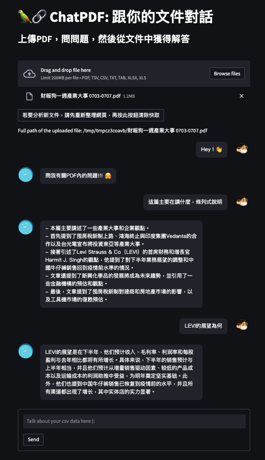

# ChatPDF

This is a toy project about chatbot for pdf.

## Setup

Python version 3.9.13

Install the package 

```bash
pip install -r requirements.txt
```

You need to create `.env` in the root.

The `.env` should be like

```bash
OPENAI_API_KEY = <your token>
```


## Start up

```bash
cd src/
streamlit run app.py
```


## Demo


